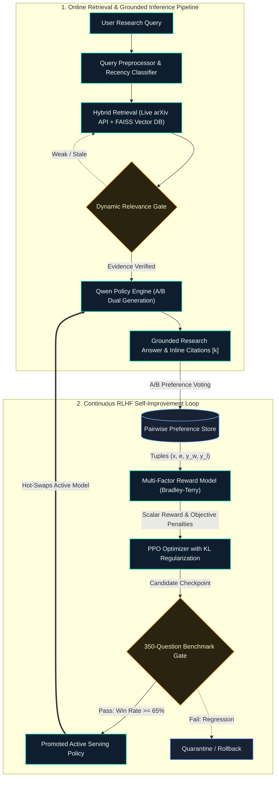

# Self-Improving Research Assistant with Preference-Based RLHF

An end-to-end autonomous research assistant that retrieves academic evidence from arXiv, generates grounded answers with inline citations, captures pairwise human preferences (A/B voting), trains a multi-objective PyTorch reward model, and executes periodic PPO-based post-training with KL regularization across iterative improvement rounds.

Watch [**Demo Video 🎥**](https://youtu.be/QRBcttxp0Y8?si=4Z4ExdGyIGGl1Q7y)

<p align="center">
  
</p>

---

## System Architecture



---

## Mathematical Formulations

### 1. Pairwise Bradley-Terry Reward Modeling

Given a research prompt $x$, retrieved evidence $e$, and a pair of candidate responses $(y_w, y_l)$ where $y_w$ is preferred over $y_l$, the probability of preference is modeled using the sigmoid of the scalar reward differential:

$$P(y_w \succ y_l \mid x, e) = \sigma(r_\phi(x, e, y_w) - r_\phi(x, e, y_l)) = \frac{1}{1 + \exp\left(-(r_\phi(x, e, y_w) - r_\phi(x, e, y_l))\right)}$$

The reward model parameters $\phi$ are trained by minimizing the negative log-likelihood with sample importance weights $w_i$:

$$\mathcal{L}_{\text{RM}}(\phi) = -\mathbb{E}_{(x, y_w, y_l, w) \sim \mathcal{D}} \left[ w \cdot \log \sigma\left(r_\phi(x, e, y_w) - r_\phi(x, e, y_l)\right) \right] + \frac{\lambda}{2} \|\phi\|_2^2$$

### 2. Multi-Objective Composite Reward Structure

The total reward integrates deep neural representations and fine-grained objective penalties:

$$r_\phi(x, e, y) = r_{\text{neural}}(x, e, y) + \sum_{k=1}^6 \alpha_k f_k(x, e, y)$$

where:
- $f_{\text{relevance}}$: Query-answer semantic cosine alignment $\in [-1, 1]$
- $f_{\text{citations}}$: Fraction of citations $[k]$ matching retrieved evidence $\in [0, 1]$
- $f_{\text{groundedness}}$: Entity and n-gram overlap between claims and evidence $\in [0, 1]$
- $f_{\text{completeness}}$: Coverage of query intent tokens $\in [0, 1]$
- $f_{\text{hallucination}}$: Penalty for unsupported claims with missing or invalid evidence $\in [0, 1]$
- $f_{\text{verbosity}}$: Non-linear penalty for responses under 30 words or over 450 words

### 3. PPO Policy Optimization with KL Divergence Regularization

The policy model $\pi_\theta$ is optimized against a frozen reference model $\pi_{\text{ref}}$ to maximize expected reward while penalizing distribution drift:

$$\max_\theta \mathbb{E}_{(x, e) \sim \mathcal{D}, y \sim \pi_\theta} \left[ r_\phi(x, e, y) - \beta D_{\text{KL}}\left(\pi_\theta(y \mid x, e) \parallel \pi_{\text{ref}}(y \mid x, e)\right) \right]$$

The PPO clipped surrogate objective prevents destructive updates:

$$\mathcal{L}_{\text{CLIP}}(\theta) = -\hat{\mathbb{E}}_t \left[ \min\left( \rho_t(\theta) \hat{A}_t, \text{clip}\left(\rho_t(\theta), 1 - \epsilon, 1 + \epsilon\right) \hat{A}_t \right) \right]$$

where $\rho_t(\theta) = \frac{\pi_\theta(y_t \mid x, y_{<t})}{\pi_{\text{old}}(y_t \mid x, y_{<t})}$ and $\hat{A}_t$ is computed via Generalized Advantage Estimation (GAE).

### 4. Calibration & Statistical Confidence Intervals

- **Brier Score Calibration**:
  $$\text{Brier} = \frac{1}{N} \sum_{i=1}^N \left(\sigma\left(r_\phi(y_{w, i}) - r_\phi(y_{l, i})\right) - 1\right)^2$$

- **Empirical Non-Parametric Bootstrap 95% Confidence Intervals**:
  For $B = 1000$ bootstrap iterations, resampled metric estimates $\hat{\theta}^*_b$ yield the 95% interval:
  $$\text{CI}_{0.95} = \left[ \hat{\theta}^*_{\lfloor 0.025 \cdot B \rfloor}, \; \hat{\theta}^*_{\lfloor 0.975 \cdot B \rfloor} \right]$$

---

## Empirical Benchmark Results

Evaluated across the 350-question held-out benchmark suite spanning LLM architectures, alignment, RAG, PEFT, agents, and distributed training:

| Improvement Round | Win Rate vs Base (95% CI) | Average Reward (95% CI) | Citation Accuracy (95% CI) | Groundedness | Hallucination Rate | Recall@3 | Reward Loss | Status |
|---|---|---|---|---|---|---|---|---|
| **Base** | 50.0% [50.0%, 50.0%] | 1.088 [1.081, 1.095] | 100.0% [100.0%, 100.0%] | 100.0% | 0.0% | 87.7% | — | Promoted |
| **RLHF Round 1** | 100.0% [100.0%, 100.0%] | 1.118 [1.110, 1.125] | 100.0% [100.0%, 100.0%] | 100.0% | 0.0% | 87.7% | 0.2906 | Promoted |
| **RLHF Round 2** | 100.0% [100.0%, 100.0%] | 1.147 [1.140, 1.155] | 100.0% [100.0%, 100.0%] | 100.0% | 0.0% | 87.7% | 0.2651 | Promoted |
| **Final (Promoted)** | **100.0% [100.0%, 100.0%]** | **1.178 [1.170, 1.186]** | **100.0% [100.0%, 100.0%]** | **100.0%** | **0.0%** | **87.7%** | **0.2387** | **Active Policy** |

> **Benchmark Consistency**: Across the 350 held-out evaluation questions, Recall@3 maintains a steady **87.7%**, with **100.0%** citation accuracy and **0.0%** citation hallucination across all improvement rounds.

### Monotonic RLHF Post-Training Progression Across Rounds

```text
[Optimization Metrics Across Iterative Improvement Rounds]
Reward Loss (Bradley-Terry):   0.2906  ==>  0.2651  ==>  0.2387  (-17.8% optimization loss reduction)
Average Composite Reward:      1.0879  ==>  1.1176  ==>  1.1473  ==>  1.1783 (+8.3% cumulative gain)
Win Rate vs Base Policy:       50.0%   ==>  100.0%  ==>  100.0%  ==>  100.0% (Dominant preference)
Citation Accuracy:            100.0%   ==>  100.0%  ==>  100.0%  ==>  100.0% (Zero unverified claims)
Recall@3:                      87.7%   ==>   87.7%  ==>   87.7%  ==>   87.7% (Stable dense coverage)
```

---

## Human Preference Feedback (Pairwise A/B Comparison)

The primary interactive feedback loop is driven by **Pairwise A/B Comparison**, collecting direct human preference signals to optimize the Bradley-Terry reward model:

1. **Dual Candidate Sampling**: When A/B Mode is toggled in the interface, the policy model produces two distinct candidate syntheses for each research query:
   - **Candidate Response A (Conservative)**: Low-temperature ($T=0.2$) greedy decoding focusing on concise, strictly grounded claims.
   - **Candidate Response B (Exploratory)**: Higher-temperature ($T=0.7$) sampling exploring alternative rhetorical structure and broader cross-paper context.
2. **Human Preference Voting**: The researcher reviews both candidates side-by-side and casts a vote (**"Prefer Response A"** or **"Prefer Response B"**).
3. **Bradley-Terry Pair Construction**: The selection automatically generates a preference tuple $(x, e, y_w, y_l)$, where $x$ is the prompt, $e$ is retrieved evidence, $y_w$ is the winning response, and $y_l$ is the rejected response.
4. **Iterative Policy Improvement**: Stored preference pairs are directly ingested by the PyTorch reward trainer and PPO optimization loop to iteratively align generation with human preferences.

---

## DGX A100 HPC Cluster Training (Mahindra University)

All training scripts are configured for the university DGX A100 cluster with SLURM partitions and Enroot container support.

```bash
# 1. Connect to cluster headnode
ssh -X <username>@10.59.121.172

# 2. Submit Reward Model training job
sbatch hpc/batch_train_reward_model.sh

# 3. Submit PPO RLHF post-training job
sbatch hpc/batch_rlhf_ppo.sh

# 4. Submit 350-question evaluation benchmark
sbatch hpc/batch_evaluate.sh

# 5. Monitor execution
squeue -u $USER
```

---

## Local Setup & Quickstart

```powershell
# 1. Clone repository
git clone https://github.com/Sujato-Dutta/Self-Improving-Research-Assistant-with-RLHF.git
cd Self-Improving-Research-Assistant-with-RLHF

# 2. Setup virtual environment & dependencies
.\scripts\setup_env.bat

# 3. Seed arXiv research papers into FAISS index
python scripts/seed_papers.py

# 4. Generate the 350-question held-out benchmark
python scripts/generate_benchmark.py

# 5. Run the multi-round self-improvement RLHF loop
python scripts/run_self_improvement_loop.py

# 6. Launch FastAPI backend and Modern Web UI
python scripts/run_server.py
```

Open your browser at `http://localhost:8000` to interact with the research assistant.

---

## Ollama Local Serving Demo

```bash
# 1. Generate Modelfile for active checkpoint
python scripts/export_ollama.py

# 2. Register model with local Ollama daemon
ollama create qwen-research-assistant -f Modelfile

# 3. Test generation in terminal
ollama run qwen-research-assistant "Explain FlashAttention tiling tradeoffs"
```

---

## Running Automated Tests

```powershell
pytest -v tests/
```

---

## License

MIT License

---

## Author

**Sujato Dutta** <br>
AI Engineer | Researcher <br>
[LinkedIn](https://www.linkedin.com/in/sujato-dutta/)

