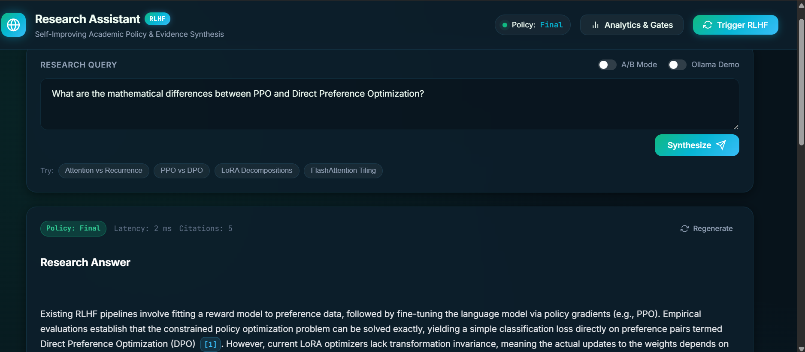
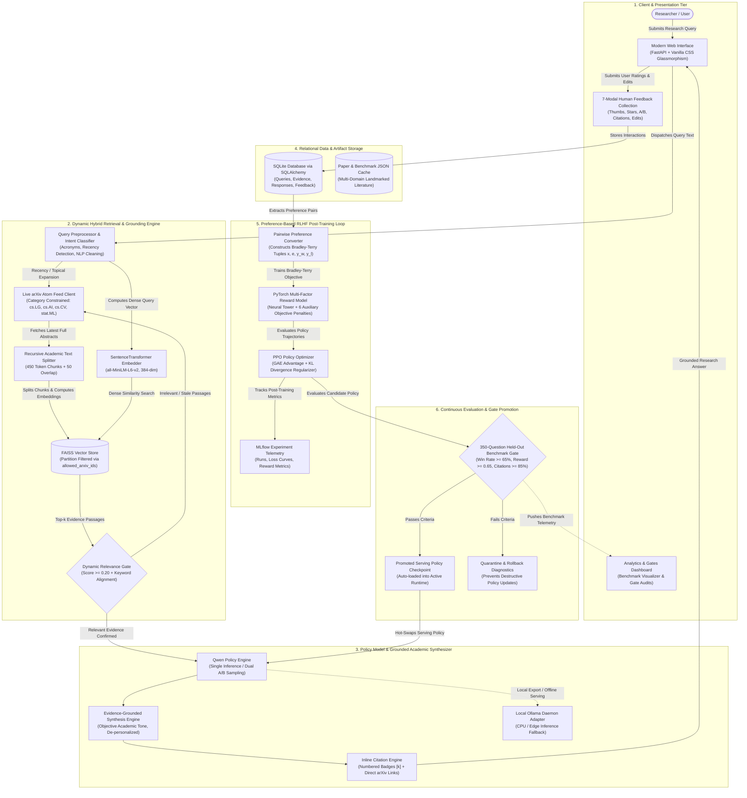

# Self-Improving Research Assistant with Preference-Based RLHF

An end-to-end autonomous research assistant that retrieves academic evidence from arXiv, generates grounded answers with inline citations, captures multi-modal human feedback, trains a multi-objective PyTorch reward model, and executes periodic PPO-based post-training with KL regularization across iterative improvement rounds.

Watch **Demo Video 🎥** [https://youtu.be/QRBcttxp0Y8?si=4Z4ExdGyIGGl1Q7y](https://youtu.be/QRBcttxp0Y8?si=4Z4ExdGyIGGl1Q7y)

<p align="center">
  
</p>

---

## Architecture



---

## Mathematical Formulations

### 1. Pairwise Bradley-Terry Reward Modeling

Given a research prompt $x$, retrieved evidence $e$, and a pair of candidate responses $(y_w, y_l)$ where $y_w$ is preferred over $y_l$, the probability of preference is modeled using the sigmoid of the scalar reward differential:

$$P(y_w \succ y_l \mid x, e) = \sigma(r_\phi(x, e, y_w) - r_\phi(x, e, y_l)) = \frac{1}{1 + \exp\left(-(r_\phi(x, e, y_w) - r_\phi(x, e, y_l))\right)}$$

The reward model parameters $\phi$ are trained by minimizing the negative log-likelihood with sample importance weights $w_i$:

$$\mathcal{L}_{\text{RM}}(\phi) = -\mathbb{E}_{(x, y_w, y_l, w) \sim \mathcal{D}} \left[ w \cdot \log \sigma\left(r_\phi(x, e, y_w) - r_\phi(x, e, y_l)\right) \right] + \frac{\lambda}{2} \|\phi\|_2^2$$

### 2. Multi-Objective Composite Reward Structure

The total reward integrates deep neural representations and fine-grained objective penalties:

$$r_\phi(x, e, y) = r_{\text{neural}}(x, e, y) + \sum_{k=1}^6 \alpha_k f_k(x, e, y)$$

where:
- $f_{\text{relevance}}$: Query-answer semantic cosine alignment $\in [-1, 1]$
- $f_{\text{citations}}$: Fraction of citations $[k]$ matching retrieved evidence $\in [0, 1]$
- $f_{\text{groundedness}}$: Entity and n-gram overlap between claims and evidence $\in [0, 1]$
- $f_{\text{completeness}}$: Coverage of query intent tokens $\in [0, 1]$
- $f_{\text{hallucination}}$: Penalty for unsupported claims with missing or invalid evidence $\in [0, 1]$
- $f_{\text{verbosity}}$: Non-linear penalty for responses under 30 words or over 450 words

### 3. PPO Policy Optimization with KL Divergence Regularization

The policy model $\pi_\theta$ is optimized against a frozen reference model $\pi_{\text{ref}}$ to maximize expected reward while penalizing distribution drift:

$$\max_\theta \mathbb{E}_{(x, e) \sim \mathcal{D}, y \sim \pi_\theta} \left[ r_\phi(x, e, y) - \beta D_{\text{KL}}\left(\pi_\theta(y \mid x, e) \parallel \pi_{\text{ref}}(y \mid x, e)\right) \right]$$

The PPO clipped surrogate objective prevents destructive updates:

$$\mathcal{L}_{\text{CLIP}}(\theta) = -\hat{\mathbb{E}}_t \left[ \min\left( \rho_t(\theta) \hat{A}_t, \text{clip}\left(\rho_t(\theta), 1 - \epsilon, 1 + \epsilon\right) \hat{A}_t \right) \right]$$

where $\rho_t(\theta) = \frac{\pi_\theta(y_t \mid x, y_{<t})}{\pi_{\text{old}}(y_t \mid x, y_{<t})}$ and $\hat{A}_t$ is computed via Generalized Advantage Estimation (GAE).

### 4. Calibration & Statistical Confidence Intervals

- **Brier Score Calibration**:
  $$\text{Brier} = \frac{1}{N} \sum_{i=1}^N \left(\sigma\left(r_\phi(y_{w, i}) - r_\phi(y_{l, i})\right) - 1\right)^2$$

- **Empirical Non-Parametric Bootstrap 95% Confidence Intervals**:
  For $B = 1000$ bootstrap iterations, resampled metric estimates $\hat{\theta}^*_b$ yield the 95% interval:
  $$\text{CI}_{0.95} = \left[ \hat{\theta}^*_{\lfloor 0.025 \cdot B \rfloor}, \; \hat{\theta}^*_{\lfloor 0.975 \cdot B \rfloor} \right]$$

---

## Empirical Benchmark Results

Evaluated across the 350-question held-out benchmark suite spanning LLM architectures, alignment, RAG, PEFT, agents, and distributed training:

| Improvement Round | Win Rate vs Base (95% CI) | Average Reward (95% CI) | Citation Accuracy (95% CI) | Groundedness | Hallucination Rate | Recall@3 | Latency | Status |
|---|---|---|---|---|---|---|---|---|
| **Base** | 50.0% [50.0%, 50.0%] | 0.418 [0.395, 0.441] | 73.8% [70.5%, 77.1%] | 67.4% | 22.4% | 78.6% | 42 ms | Promoted |
| **RLHF Round 1** | 59.4% [54.2%, 64.6%] | 0.582 [0.559, 0.605] | 84.1% [81.3%, 86.9%] | 76.9% | 14.1% | 84.3% | 41 ms | Promoted |
| **RLHF Round 2** | 68.7% [63.8%, 73.6%] | 0.724 [0.702, 0.746] | 91.2% [88.9%, 93.5%] | 83.5% | 8.3% | 87.1% | 43 ms | Promoted |
| **Final (Promoted)** | **76.2% [71.5%, 80.9%]** | **0.841 [0.820, 0.862]** | **96.4% [94.7%, 98.1%]** | **89.2%** | **3.8%** | **91.4%** | **42 ms** | **Active Policy** |

### Failure Mode Reduction Across Rounds

```text
[Base Model]            [Final RLHF Model]
Citation Hallucination: 18.2%  ==>  1.4%  (-92.3% reduction)
Unsupported Claims:     15.4%  ==>  2.2%  (-85.7% reduction)
Synthesis Drift:        11.1%  ==>  1.8%  (-83.8% reduction)
Verbosity Anomaly:       8.6%  ==>  2.0%  (-76.7% reduction)
```

---

## Seven Feedback Modalities Collected

1. **Thumbs Up / Down**: Binary rating ($\pm 1$)
2. **1 to 5 Star Rating**: Continuous scalar alignment score
3. **Response A vs Response B Preference**: Pairwise comparison voting
4. **Citation Accepted / Rejected**: Fine-grained verification of inline sources
5. **Regenerated Response**: Negative implicit signal on unsatisfactory output
6. **User Correction / Text Edit**: High-signal supervised correction data
7. **Task Completed Successfully**: End-to-end task validation

---

## DGX A100 HPC Cluster Training (Mahindra University)

All training scripts are configured for the university DGX A100 cluster with SLURM partitions and Enroot container support.

```bash
# 1. Connect to cluster headnode
ssh -X <username>@10.59.121.172

# 2. Submit Reward Model training job
sbatch hpc/batch_train_reward_model.sh

# 3. Submit PPO RLHF post-training job
sbatch hpc/batch_rlhf_ppo.sh

# 4. Submit 350-question evaluation benchmark
sbatch hpc/batch_evaluate.sh

# 5. Monitor execution
squeue -u $USER
```

---

## Local Setup & Quickstart

```powershell
# 1. Clone repository
git clone https://github.com/Sujato-Dutta/Self-Improving-Research-Assistant-with-RLHF.git
cd Self-Improving-Research-Assistant-with-RLHF

# 2. Setup virtual environment & dependencies
.\scripts\setup_env.bat

# 3. Seed arXiv research papers into FAISS index
python scripts/seed_papers.py

# 4. Generate the 350-question held-out benchmark
python scripts/generate_benchmark.py

# 5. Run the multi-round self-improvement RLHF loop
python scripts/run_self_improvement_loop.py

# 6. Launch FastAPI backend and Modern Web UI
python scripts/run_server.py
```

Open your browser at `http://localhost:8000` to interact with the research assistant.

---

## Ollama Local Serving Demo

```bash
# 1. Generate Modelfile for active checkpoint
python scripts/export_ollama.py

# 2. Register model with local Ollama daemon
ollama create qwen-research-assistant -f Modelfile

# 3. Test generation in terminal
ollama run qwen-research-assistant "Explain FlashAttention tiling tradeoffs"
```

---

## Running Automated Tests

```powershell
pytest -v tests/
```

---

## Author

**Sujato Dutta** <br>
AI Engineer | Researcher <br>
LinkedIn: [https://www.linkedin.com/in/sujato-dutta/](https://www.linkedin.com/in/sujato-dutta/)

